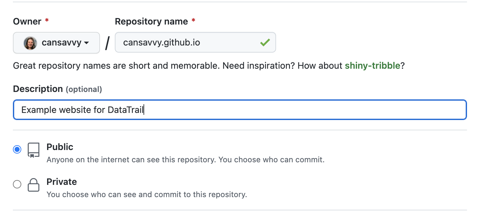
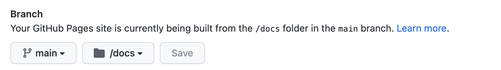

## Exercise 1: Make your own website!

1. Make a new repository and name it `username.github.io`

But put your own github username where it says "username".
Make sure this repository is public and initialize it with a README.



2. Go to RStudio cloud.  Open up a new project using the steps to create a project from a GitHub repository. You can see these instructions here to refresh your memory: https://datatrail-jhu.github.io/04_githubbasics/creating-a-repository.html

3. In this new RStudio cloud project, create a RMarkdown document.  Save the R Markdown document as the name "index.Rmd" and put it in a folder called "docs". This is important for publishing purposes!

4. Put the content you want on the website in this RMarkdown. You might want to use a template like this: 

```
## About

Describe who you are. For example, what you are currently studying.

Summarize your trajectory. You could mention what you've done. Like what you've studied or where you've worked.

## Interests

* Interest 1
* Interest 2
* etc

## Projects

* List some of your recent projects
* You could include this website as a project!

## Profiles

* [LinkedIn](https://www.linkedin.com/in/yourprofile/)
* ...
* [GitHub](http://github.com/username)

## Contact

* [youremail@email](mailto:youremail@email)
```

5. Edit the theme to your liking by following these instructions: https://datatrail-jhu.github.io/05_R/creating-websites-with-r.html#change-the-theme

6. Knit the R Markdown document to see how it will look.

7. When you have it close enough to what you'd like it to look like, add, commit, and push the changes to your GitHub repository. Here's the instructions on how to do that if you need a refresher: https://datatrail-jhu.github.io/04_githubbasics/pushing-and-pulling-changes.html

8. Go to your GitHub repository. Go to Settings > Pages. You should see a URL to your new website.  Scroll down and underneath "Branch" change the folder to "docs" and click save!



9. Go to the site (it will take a few minutes for it to properly render). The URL will be something like this:
https://username.github.io/

## Exercise 2: Understanding functions!

What are functions? We've been using them this whole time but they still probably seem mysterious. 

In R, functions have this kind of look (or syntax): 

`something()`

To find out more about a function we've also talked about how you can use the Help window or look up the function's Help page by using a `?` in front like: 

`?dir`


Functions take input and do something with that input to give you some kind of output. 

You may think at this point, but I sometimes have used functions like below and not put any input! 

```{r}
dir()
```

You are correct that *you* don't always have to specify the input but if you haven't specified it then usually that is because R has a default input specified for you. 

In the case of `dir()` we can look up `?dir` and see that the default input is `path = "."`. 

The things we give a function to specify what we want are called "arguments". In this case `path` is an argument with a default. But we can change that to something else if we wish.

```{r}
dir("..")
```

## How are functions made?

One way to get a better understanding of functions is to make one ourselves.

To make a function, called "greet()" for example, it would look like this:

```{r}
greet <- function() {
}
```

Here's what this set up looks like:
```
# The name of the function is assigned and the function() set up is used. 
greet <- function(# Arguments) {

  # Body of the function -- what do we want to happen when the greet() function is used? 
}
```

If you have run the chunk above you can run `greet()` but note we didn't put anything inside the `{` `}` so nothing will really happen. 

```{r}
greet()
```

Let's make our function actually do something: 
In this new iteration of the function we will have it print "Hello!" to us: 
Note that we are `<-` assigning it the same name so this will save over our old, empty function. 

```{r}
greet <- function() {
  cat("Hello!")
}
```

Test this new version of the function: 

```{r}
greet()
```

Now we can see this prints out `Hello!` whenever we run `greet()`. 

### Adding arguments

If we want to make this function have an option, we can add an argument. Let's re-make this function again but with an argument.

Here we will specify a `name` to say hello to as our argument. 
Inside the `function()` parantheses, we specify our argument, called `name`. 

Then, in the body of the function, we have to put where we want the `name` argument's value to be used. In this instance, we add it to the `print()` function because we want a message to be printed out that says `Hello` + the name specified. 

```{r}
greet <- function(name) {
  cat("Hello", name, "!")
}
```

Let's test this new version of this function. 

```{r}
greet(name = "Clive")
```

But, note that this will break if we don't specify any argument for `name`.

```{r, error = TRUE}
greet()
```

R tells us `argument "name" is missing, with no default` which is basically it saying "I needed something for `name` but I wasn't given anything so I can't run this function, greet()." 

### Setting defaults for arguments

This may be how you want the function to work, but if you want it to run whether or not `name` is specified, you'll need to set a default. 

To set a default, we have to put an `=` for whatever the default is in the `function()` part. In this case our default `name` argument value will be `"no one"`.

```{r}
greet <- function(name = "no one") {
  cat("Hello", name, "!")
}
```

Now we can run this without specifying `name`. 

```{r}
greet()
```

But we still have the ability to specify a `name`:

```{r}
greet(name = "Ferdinand")
```

For more practice on functions, [go through this Carpetnries lesson](https://swcarpentry.github.io/r-novice-inflammation/02-func-R/). 

## Print out session info 

```{r}
sessionInfo()
```
